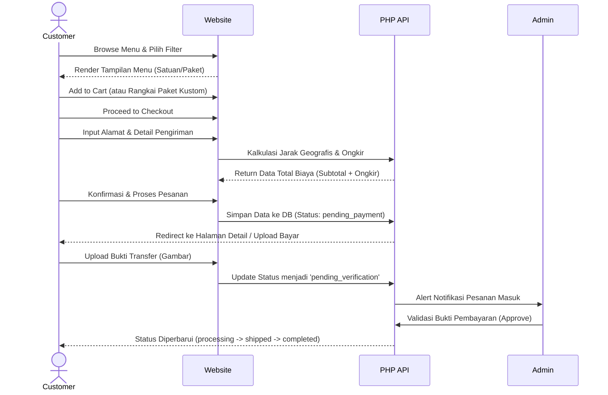

# 🍰 Zarali's Catering - Web Application Description

## 1. Product Overview
Zarali's Catering adalah platform e-commerce dan manajemen pemesanan (Order Management System) berbasis web yang dikhususkan untuk bisnis katering kue tradisional. Platform ini memfasilitasi pelanggan untuk memesan berbagai macam kue tradisional (baik satuan maupun paket besar/nampan) dengan sistem pengiriman terintegrasi (khusus area Depok). Aplikasi ini dilengkapi dengan portal pelanggan untuk melacak pesanan dan portal admin yang komprehensif untuk mengelola inventaris, pesanan, verifikasi pembayaran, keuangan, hingga fitur live chat interaktif.

## 2. Pengguna Website (User Roles)
Sistem ini dirancang untuk 3 jenis interaksi pengguna:
1. **Guest (Tamu):** Pengunjung yang belum memiliki akun. Dapat melihat katalog menu, menambahkan produk ke keranjang, menggunakan fitur *live chat*, dan melakukan pemesanan langsung tanpa perlu registrasi (Guest Checkout).
2. **Customer (Pelanggan Terdaftar):** Pengguna yang sudah membuat akun. Memiliki akses penuh ke fungsionalitas pelanggan seperti riwayat pembelian, pelacakan status pesanan secara *real-time*, sinkronisasi notifikasi, dan manajemen profil (menyimpan alamat utama).
3. **Administrator:** Pemilik atau pengelola operasional bisnis. Memiliki akses ke *Admin Dashboard* (Backend) untuk mengelola seluruh operasional termasuk pesanan, menu, transaksi keuangan, pengaturan sistem (biaya ongkir, lokasi toko), dan membalas pesan *Live Chat* pelanggan.

## 3. Core Features (Fitur Utama)
- **Katalog Menu Dinamis:** Menampilkan produk kategori "Kue Satuan" dan "Paket Besar" dengan fitur pengurutan (Sorting) kustom: Terbaru, Harga Tertinggi, Harga Terendah, dan Terpopuler.
- **Sistem Pembuatan Paket Kustom (Custom Package Bundle):** Pelanggan dapat membuat paket/nampan sendiri dengan aturan bisnis khusus (misal: min. 3 kue per paket, pesanan min. 10 paket).
- **Cart & Dynamic Checkout Engine:** Sistem keranjang belanja cerdas dengan kalkulasi ongkos kirim dinamis berdasarkan hitungan metrik jarak (Shipping Distance) yang terintegrasi dengan koordinat toko di pengaturan bisnis.
- **Payment & Verification:** Proses unggah bukti pembayaran transfer (Payment Proof) oleh pelanggan dan proses verifikasi manual oleh sisi admin.
- **Order Management & Tracking:** Pelanggan dapat melacak status pesanan secara detail dari awal hingga akhir (`pending_payment` -> `pending_verification` -> `processing` -> `shipped` -> `completed`).
- **Live Chat Real-time:** Sistem perpesanan asinkron (AJAX polling) yang memungkinkan komunikasi dua arah secara langsung antara pelanggan/guest dengan Admin. Termasuk floating widget.
- **Admin Dashboard:**
  - **Manajemen Pesanan:** Validasi pembayaran, perbarui tahapan pesanan, serta fitur mencetak Invoice pesanan (Print Invoice).
  - **Manajemen Katalog Menu:** Operasi CRUD (Create, Read, Update, Delete) informasi produk dan aset gambar.
  - **Manajemen Keuangan:** Pencatatan otomatis pendapatan dari pesanan selesai, dan pencatatan pengeluaran operasional.
  - **Pengaturan Sistem:** Pembaruan nama bisnis, nomor kontak, detail rekening bank, dan tarif ongkos kirim per KM.

## 4. Tech Stack (Teknologi yang Digunakan)
Aplikasi ini dibangun menggunakan arsitektur Monolitik dengan kombinasi Server-Side Processing dan Client-Side Interactivity.
- **Frontend / UI Layer:**
  - **HTML5 & CSS3:** Menggunakan integrasi komponen Framework **Bootstrap 5** dan Custom CSS murni (`css/custom.css`).
  - **JavaScript (ES6):** Vanilla Javascript untuk manipulasi DOM dan logika *shopping cart*, serta asinkron API Calls menggunakan `fetch`/AJAX (polling live chat, filter katalog).
  - **UI Assets:** Google Fonts (Inter, Outfit), Material Symbols (Google Icons).
- **Backend / Logic Layer:**
  - **PHP 8 (Native):** Menggunakan pure PHP dengan pembagian struktur mendekati *MVC pattern* (`/api` untuk *endpoint handlers*, `/models` untuk class representasi entitas, dan *helpers* untuk session/middleware).
- **Database / Data Layer:**
  - **MySQL (Relational Database):** Skema data yang komprehensif mengelola entitas terelasi (tabel `users`, `orders`, `products`, `financial_transactions`, `business_settings`, dll).

## 5. App Flow (Arsitektur Sistem)
Diagram ini menjelaskan interaksi arsitektur secara keseluruhan antara Klien, Server, dan Database.

```mermaid
graph TD
    Client[Client Browser / Device]
    WebUI[Frontend: HTML/CSS/JS]
    Backend[Backend: PHP & API Endpoints]
    DB[(MySQL Database)]

    Client -->|HTTP Requests| WebUI
    WebUI -->|AJAX/Fetch API| Backend
    WebUI -->|Form Submissions| Backend
    Backend -->|SQL Queries (PDO/MySQLi)| DB
    DB -->|Result Set| Backend
    Backend -->|JSON Responses / HTML Render| WebUI
    WebUI -->|DOM Updates & Notifications| Client
```

## 6. User Flows
Berikut ini adalah pemodelan alur langkah-langkah yang dilakukan pengguna saat berinteraksi di dalam aplikasi.

### A. Alur Pemesanan Pelanggan (Customer Ordering Flow)
Menggambarkan perjalanan end-to-end seorang pelanggan dalam membuat satu pesanan.



### B. Alur Manajemen Operasional Admin (Admin Operational Flow)
Menggambarkan prosedur standar yang dilakukan oleh admin untuk menangani sebuah siklus pesanan.

```mermaid
flowchart TD
    Start[Admin Menerima Notifikasi Pesanan Baru] --> B[Akses Admin Dashboard]
    B --> C{Cek Tab Pesanan: \n'Menunggu Verifikasi'}
    C --> D[Review Bukti Upload Pembayaran]
    D --> E{Apakah Bukti Valid & \nDana Masuk?}
    E -->|Valid| F[Set Status: Processing\nSiapkan Pesanan]
    E -->|Tidak Valid| G[Set Status: Cancelled / \nChat Customer]
    F --> H[Kirim Pesanan (Kurir)]
    H --> I[Set Status: Shipped]
    I --> J[Pesanan Sampai & Diterima]
    J --> K[Set Status: Completed]
    K --> L[Generate Invoice & \nPencatatan Laporan Keuangan Otomatis]
    L --> End[Selesai]
```
